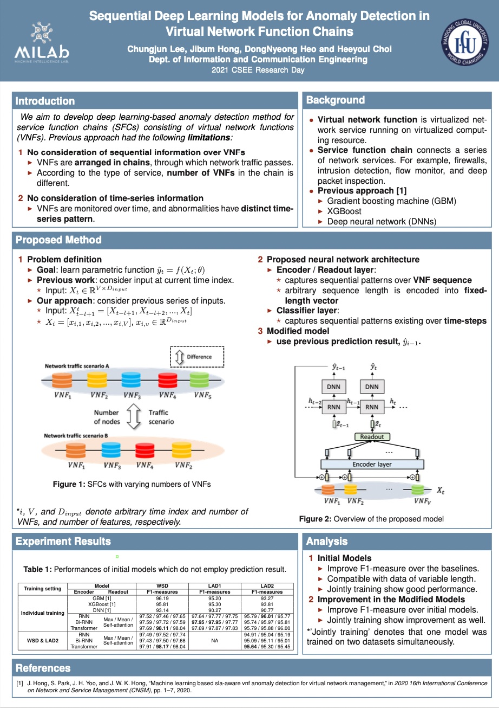

# Supervied anomaly detection project

## Project description
Software-defined networking (SDN) and network function virtualization (NFV) have enabled the efficient provision of network service. However, they also raised new tasks to monitor and ensure the status of virtualized service, and anomaly detection is one of such tasks. There have been many data-driven approaches to implement anomaly detection system (ADS) for virtual network functions in service function chains (SFCs). In this paper, we aim to develop more advanced deep learning models for ADS. Previous approaches used learning algorithms such as random forest (RF), gradient boosting machine (GBM), or deep neural networks (DNNs). However, these models have not utilized sequential dependencies in the data. Furthermore, they are limited as they can only apply to the SFC setting from which they were trained. Therefore, we propose several sequential deep learning models to learn time-series patterns and sequential patterns of the virtual network functions (VNFs) in the chain with variable lengths. As a result, the suggested models improve detection performance and apply to SFCs with varying numbers of VNFs.

- published paper
    - <a href="https://arxiv.org/abs/2109.14276" title="paper">sequential deep learning architectures for anomaly detection in virtual network function chains</a>

- poster
    - 

## Usage
```bash
    # 1. prepare data
    ./ad_split_index.sh dataset_name

    # 2. individual training
    ./ad_run.sh GPU

    # 3. joint training
    ./ad_joint_train_run.sh GPU

    # please set params inside shell script accordingly
```